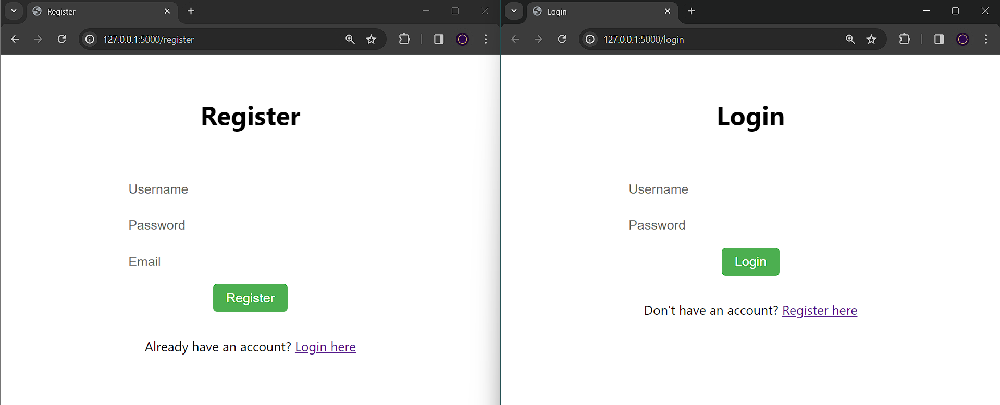
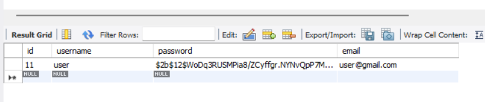
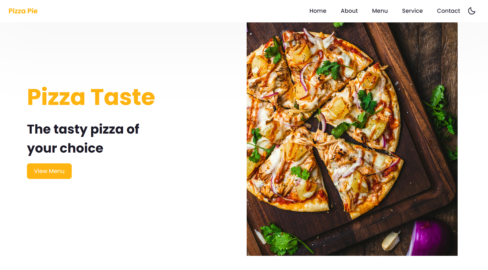

# Pizza House Management System

The Pizza House Management System is a web application developed using Flask, a Python micro-framework, and MySQL for database management. This system facilitates the management of a pizza house by providing features such as user authentication, order placement, menu management, and customer feedback.

## Features

- **User Authentication:** Users can register accounts and log in securely.
- **Order Management:** Customers can place orders, and staff members can process and track them.
- **Menu Management:** Admin users can manage the menu by adding, editing, or removing items.
- **Customer Feedback:** Customers can provide feedback on their orders, enhancing customer satisfaction.
- **Responsive Design:** The application is designed to be accessible and usable across various devices.

## Technologies Used

- Flask: Micro-framework for building web applications in Python.
- MySQL: Relational database management system for storing and managing data.
- Flask-MySQLdb: Flask extension for MySQL database integration.
- Bcrypt: Library for secure password hashing.
- HTML/CSS/JavaScript: Front-end technologies for designing and enhancing user experience.
- Git/GitHub: Version control system and hosting platform for collaborative development.

## Installation

1. Install Flask: `pip install Flask`
2. Install Flask-MySQLdb: `pip install Flask-MySQLdb`
3. Install Bcrypt: `pip install bcrypt`
4. Configure MySQL database settings in the `app.py` file.
5. Run the Flask application using `python app.py`.
6. Access the application in your web browser at [http://localhost:5000](http://localhost:5000).

## Usage

- Access the login page to authenticate as a user or register a new account.
- Navigate through the application to place orders, manage the menu, and provide feedback.
- Admin users can access additional functionalities for menu management and reporting.

## Contributing

Contributions are welcome! Feel free to fork the repository, make improvements, and submit pull requests. Please follow the Contributing Guidelines for more details.

## License

This project is licensed under the MIT License.

## Acknowledgements

Special thanks to the Flask and MySQL communities for their excellent documentation and support.

### Login and Registration Page

### Data in MySQL Table

### Successful Login - Pizza House Homepage

